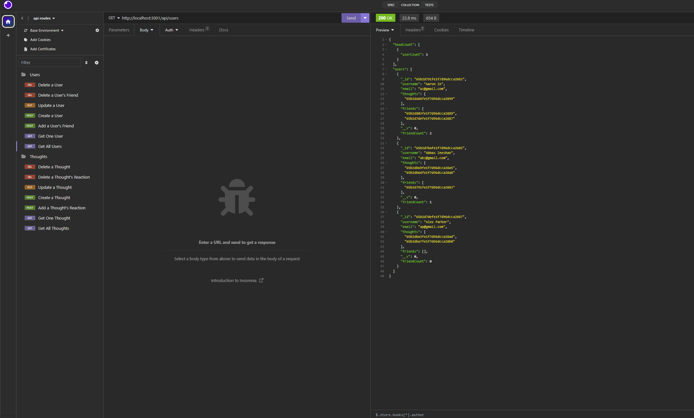
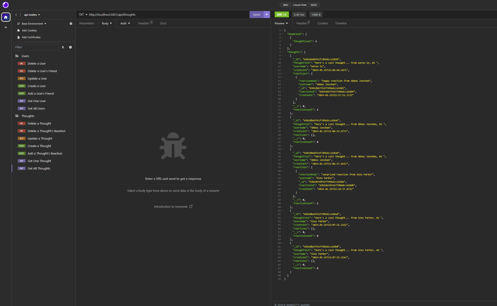
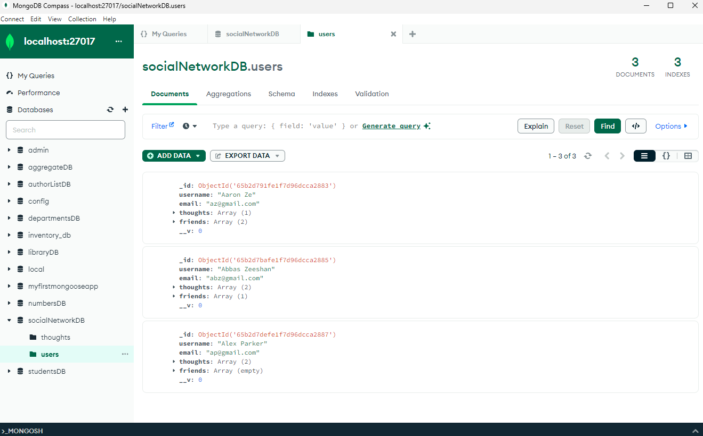
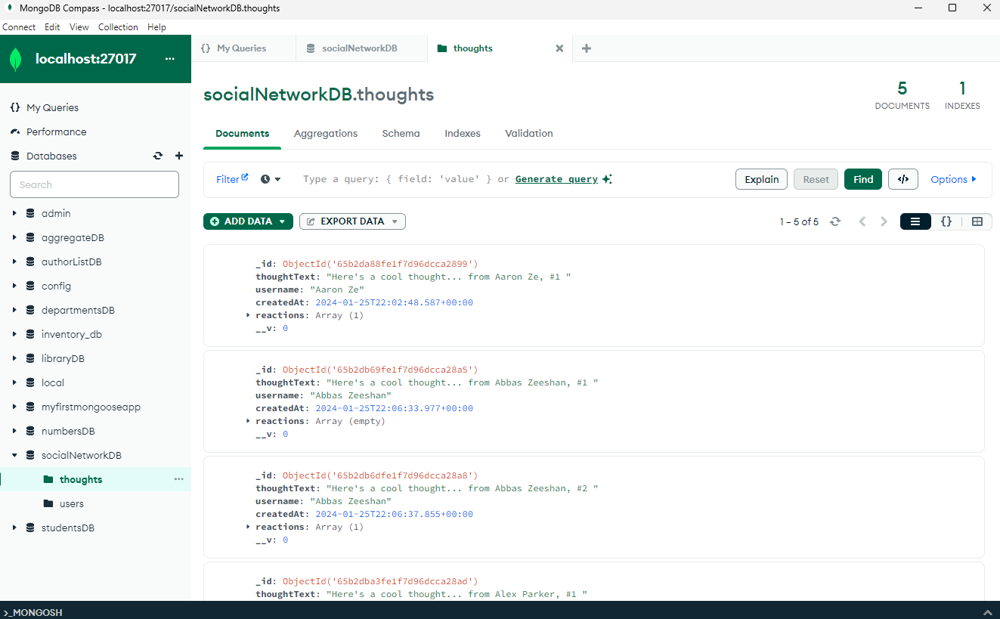

# NoSQL Social Network API

The noSQL Social Network API is a MongoDB based backend application that was created to test the functionality of noSQL database and its CRUD operations using the created models and schemas. 
The restful api GET, Post, Put and Delete methods were used to interact with the database using express.  
## Features

- noSql database uses MongoDB database, and Compass virtual envrionment to view the database collections and documents.
- mongoose library is used along-side express.js to interact with the socialNetworkDB in MongoDB. 
- Restful API is used to perform the CRUD operations of GET, Post, Put Delete on the User and Thought models/collections. 

## Appendix

https://www.mongodb.com/docs/manual/introduction/

https://www.mongodb.com/docs/compass/current/

https://mongoosejs.com/docs/2.7.x/docs/virtuals.html

https://mongoosejs.com/docs/validation.html

https://www.mongodb.com/docs/manual/reference/method/Date/

## Authors

- [Syed Kazmi](https://github.com/kazmiali123)
## Deployment

Walkthought Video: https://drive.google.com/file/d/1S1-qjbpnYsIBpL-kyt9voYTrL0ekQoit/view

GitHub Repository: https://github.com/kazmiali123/Challange-18-NoSQL-Social-Network-API

## Demo

Get All Users- Demo
  

Get All Thoughts - Demo
  

MongoDB - User Collection in Compass - Demo
  

MongoDB Thought Collection in Compass - Demo
  
